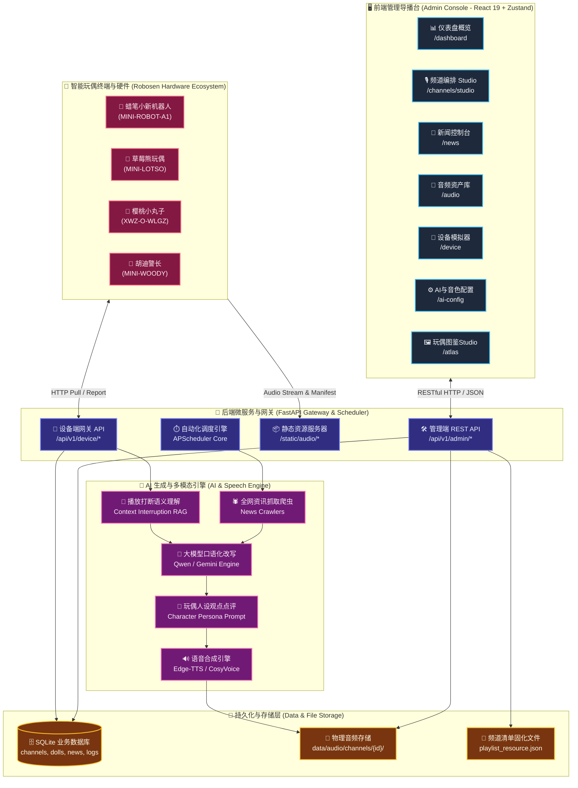
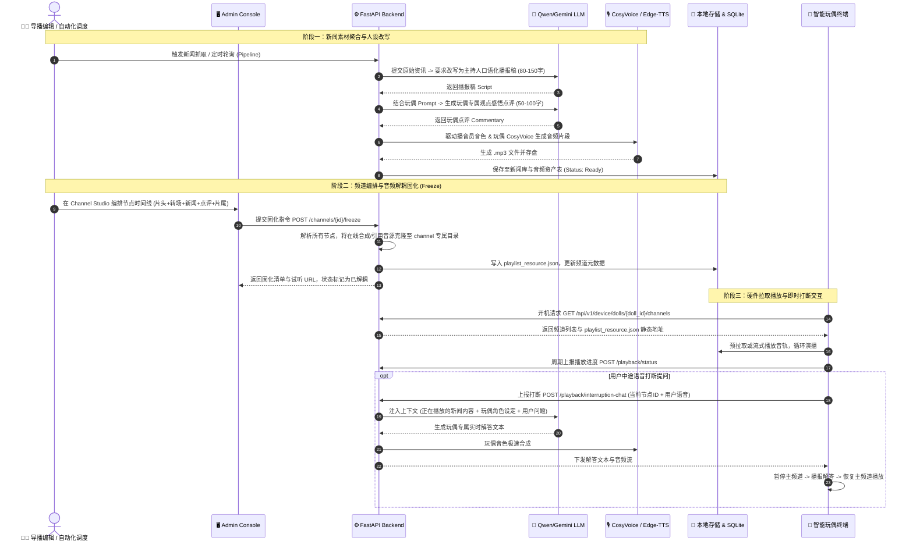
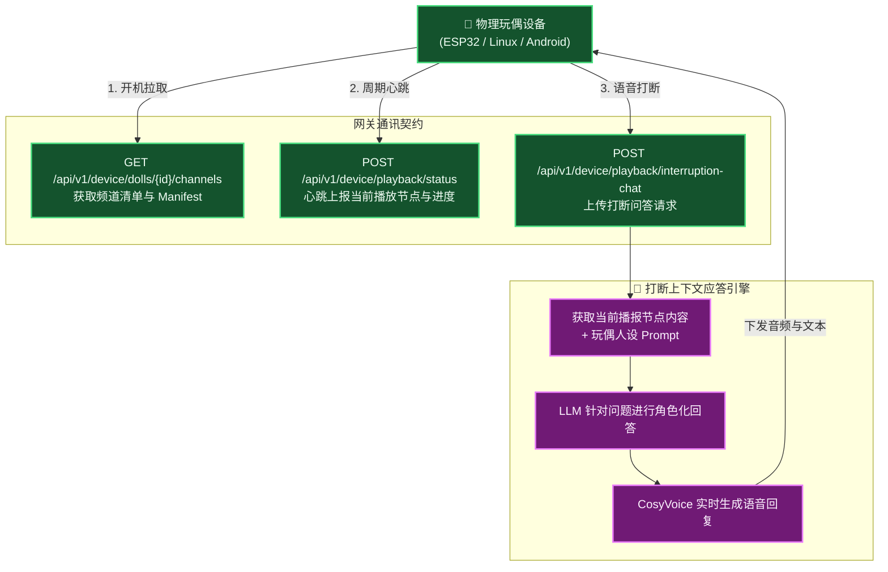
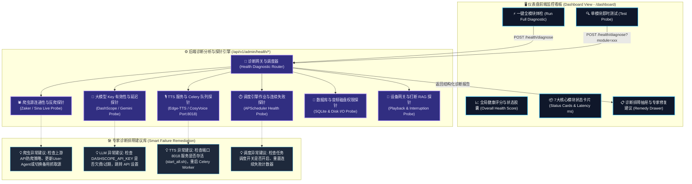
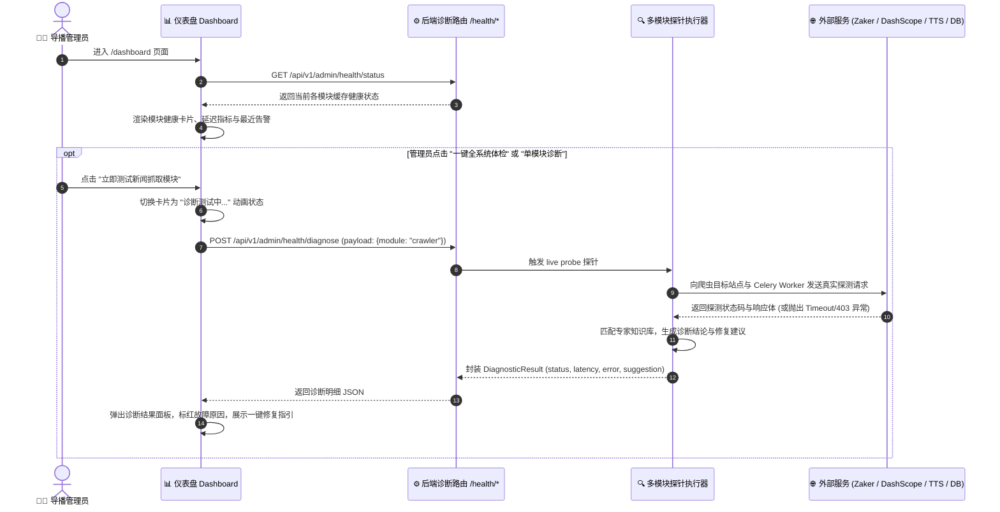
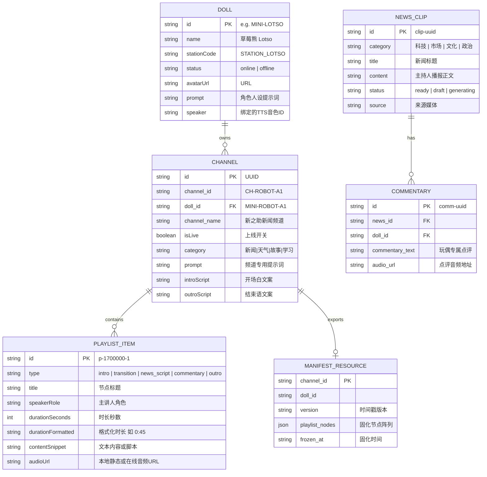
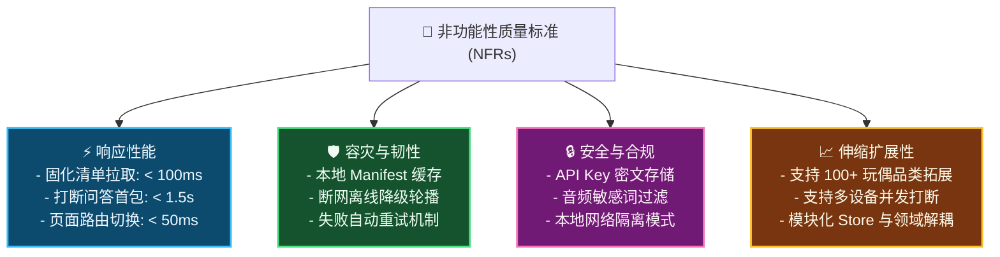
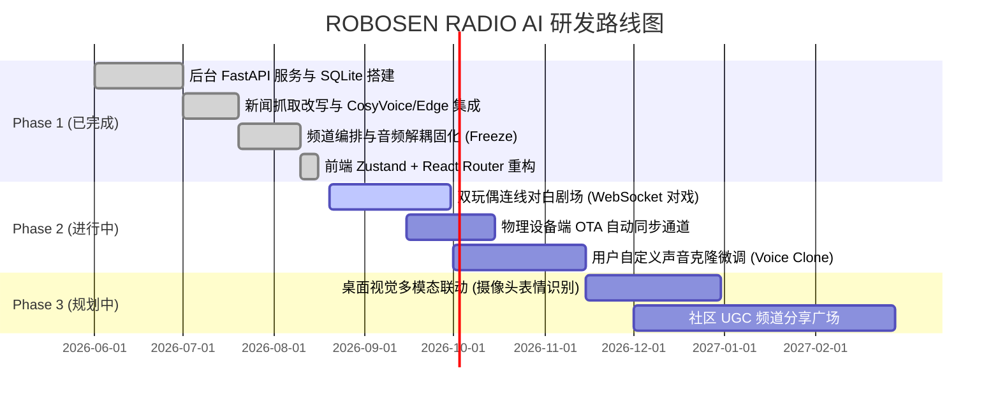

# ROBOSEN RADIO AI 桌面智能玩偶广播电台系统 - 产品需求文档 (PRD)

---

## 1. 产品概述与背景 (Product Overview & Background)

### 1.1 产品愿景与第一性原理 (First-Principles & Vision)

传统的桌面玩具/智能硬件通常面临 **“内容静态匮乏、互动模式单一、缺乏情感长效陪伴”** 的痛点。
**ROBOSEN RADIO AI** 从第一性原理出发，将实体桌面玩偶（如蜡笔小新、草莓熊、樱桃小丸子、胡迪等）转化为 **“具备人设灵魂、时效资讯驱动、支持随听随打断的桌面多模态广播电台”**。

- **内容时效性**：全网热点新闻与专题资讯自动化抓取、口语化改写、多音色演播。
- **人设灵魂化**：针对不同玩偶定制专属语气、口吻及情感点评（CosyVoice + Prompt Persona）。
- **编排自由度**：提供可视化“节点式频道导播台（Channel Studio）”，支持片头、转场、新闻、点评、教材跟读等多音轨自由混编。
- **设备轻量化与离线韧性**：一键“音频解耦与固化（Freeze）”，生成标准 `playlist_resource.json` 与独立音轨，硬件端零算力依赖，即使弱网断网亦可流畅轮播。
- **智能打断互动**：设备播放过程中支持随时语音打断，AI 结合当前播放节点上下文及玩偶人设进行实时自然对话。

---

## 2. 系统整体架构 (System Architecture)

### 2.1 总体多层系统拓扑 (System Topology)



---

### 2.2 核心业务流程：从新闻抓取到设备端演播固化



---

## 3. 功能模块详细需求规范 (Detailed Module Requirements)

```mermaid
classDef moduleHeader fill:#0F172A,stroke:#38BDF8,stroke-width:2px,color:#F8FAFC;
classDef featureBox fill:#1E293B,stroke:#94A3B8,stroke-width:1px,color:#F1F5F9;

flowchart LR
    subgraph Modules ["核心功能矩阵"]
        direction TB
        M1["玩偶与频道编排中心"]:::moduleHeader
        M2["新闻自动化调度引擎"]:::moduleHeader
        M3["声音资产与音色配置"]:::moduleHeader
        M4["硬件网关与打断交互"]:::moduleHeader
        M5["监控日志与系统支撑"]:::moduleHeader
    end
```

### 3.1 模块一：玩偶人设与频道编排中心 (Doll & Channel Studio)

#### 1. 玩偶人设注册表 (Doll Registry)

- **预设玩偶库**：支持至少 16 款预置玩偶（如草莓熊 Lotso、蜡笔小新系列 A1-A4、樱桃小丸子系列、胡迪 Woody、三眼仔 Alien、巴斯光年 Buzz、瓦力 Walle 等）。
- **玩偶人设元数据**：
  - `doll_id`（唯一标识，如 `MINI-LOTSO`）
  - `name`（显示名称）、`stationCode`（电台代号）
  - `tagline`（电台定位标语）、`roleTitle`（主播身份）
  - `prompt`（玩偶性格 Prompt，如幽默、软萌、正义感、毒舌等）
  - `speaker / voiceId`（关联的 TTS 音色模型）
  - `avatarUrl`（玩偶专属头像，支持图鉴裁切上传）

#### 2. 节点式频道时间线 (Channel Studio Timeline)

- **多类型节点混编**：
  1. **开场片头 (Intro)**：玩偶专属电台欢迎语及栏目介绍。
  2. **转场音效 (Transition)**：快节奏 Swoosh、音效扫频或 Jingle。
  3. **新闻播报稿 (News Script)**：专业主持人播报新闻正文。
  4. **玩偶独家点评 (Commentary)**：玩偶对上一条新闻发表个人见解。
  5. **结束谢幕 (Outro)**：频道收尾台呼及致谢。
  6. **拓展节点**：天气播报 (Weather)、电子宠物事件 (Pet Event)、睡前故事 (Story)、九学王教材朗读与跟读互动 (Learning)。
- **节点编辑能力**：支持拖拽排序、单节点试听（Web Speech API / TTS 后端流）、时长自定义、文案实时修改。

#### 3. 频道音频解耦与固化 (Freeze Mechanism)

- **背景**：动态频道中的新闻或点评若依赖外部实时网络，设备端在网络波动时会卡顿。
- **固化流程**：
  - 点击“解耦并固化”按钮，后端将该频道所有节点的音频文件统一物化复制到 `data/audio/channels/{doll_id}/{channel_id}/node_{item_id}.mp3`。
  - 生成 `playlist_resource.json`，并将所有音轨 URL 转为固定的本地静态路由 `/static/audio/...`。
  - 数据库同步更新 `playlist` 字段，标记该频道具备离线独立分发能力。

#### 4. 玩偶动作图鉴 Studio (Doll Atlas Studio)

- 提供 10X 超高清海报漫游与动作裁切器，支持自由比例、1:1、4:3、圆形蒙版裁剪，一键保存并自动绑定至玩偶头像。

---

### 3.2 模块二：新闻素材流与自动化调度引擎 (News Engine & Automation)


- **全网热点聚合**：支持配置科技、财经、娱乐、汽车、军事、国内、国际等标签的抓取频次与数量上限。
- **播报特刊流水线 (Pipeline)**：
  - 一键执行：抓取 -> 改写 -> 点评 -> 语音合成全自动闭环。
  - 手动微调：支持编辑修改播报文案、重新触发单条语音渲染。
- **自动化定时调度 (Scheduler)**：
  - 支持后台常驻 Cron 定时触发调度。
  - 记录每次运行的耗时、生成数量、失败详情，提供运行健康状态指示灯。

---

### 3.3 模块三：音频资产与音色生成中心 (Audio Assets & Voice Persona)

- **资产多维分类**：涵盖系统通用音效、片头曲、背景乐、转场特效、原声曲目、警报音。
- **音色方案矩阵**：
  - **新闻主讲人**：支持 Edge-TTS 男女主播（`zh-CN-XiaoxiaoNeural` / `zh-CN-YunjianNeural`）按单双序号交替播报，增强听觉层次。
  - **玩偶专属音色**：接入阿里云百炼 CosyVoice 专属定制声音（如草莓熊专属声线、蜡笔小新萌感音色、小丸子清脆声线等）。
- **音频直接关联**：音频库支持一键“分发至指定玩偶频道”，自动追加至频道播放列表中。

---

### 3.4 模块四：物理设备网关与实时交互系统 (Device Gateway & Interruption)



#### 1. 硬件端通讯协议

- **拉取频道列表**：`GET /api/v1/device/dolls/{doll_id}/channels` 返回当前玩偶已启用的所有频道配置及 `manifest_url`。
- **播放状态上报**：`POST /api/v1/device/playback/status` 硬件每隔 5~10 秒上报播放器状态（播放中、暂停、当前节点 `current_item_id`、已播秒数 `progress_seconds`）。
- **打断对话接口**：`POST /api/v1/device/playback/interruption-chat`
  - **入参**：`doll_id`, `channel_id`, `current_item_id`, `play_offset_seconds`, `user_text`
  - **响应**：`reply_text`, `reply_audio_url`, `session_id`
  - **业务逻辑**：后端拉取该节点新闻原文，构建 Prompt：“玩偶正在播报：【...】，用户打断并询问：【...】，请以【玩偶人设】做出简短机智的语音回答。”

---

### 3.5 模块五：系统配置、实时监控与回收站 (Config, Observability & Trash)

- **AI 与 API Key 设置**：统一持久化管理 DashScope API Key、Gemini Key、默认模型（`qwen-plus`, `qwen-max` 等）、TTS 服务商。
- **实时日志看板 (Live Logs)**：后端结构化收集系统调度、TTS 生成、硬件上报日志，支持按 `source`（TTS/Crawler/Backend/UI）、`level`（INFO/WARN/ERROR）与关键词过滤，支持 2 秒自动轮询与断点滚动。
- **新闻回收站 (Trash)**：支持将废弃稿件移入回收站，提供一键还原与物理清理能力。

---

### 3.6 模块六：仪表盘全系统监控与一键诊断排障中心 (Dashboard Full Observability & Failure Diagnostics)



#### 1. 监控与诊断业务背景与痛点

在复合式 AI 广播系统中，任一模块（如爬虫被反爬拦截、大模型 API Key 过期、TTS 微服务未启动、磁盘无写入权限、Celery 队列断连）出现异常都会导致业务链路中断。
传统运维方式需要登录服务器查看 `logs/crawler_worker.log` 或 `logs/tts_worker.log`，门槛高且定位慢。
**本需求要求在前端仪表盘（`/dashboard`）实现开箱即用的全模块运行监控与一键诊断自检**：

- **实时呈现**：展示各模块的运行状态（`HEALTHY` / `DEGRADED` / `DOWN` / `TESTING`）、响应延迟（ms）、最后一次检查时间及连续失败次数。
- **一键自检**：提供“全系统一键体检”及“单模块即时测试”按钮，主动发起端到端真实探针测试。
- **根因分析与排障指引**：当新闻抓取或语音生成失败时，自动提取错误堆栈，生成通俗易懂的根因分析与可点击的一键修复跳转（如快捷打开 API Key 设置弹窗、一键重启自动化调度等）。

#### 2. 七大核心模块诊断探针矩阵 (Diagnostic Probes Matrix)

| 模块名称                                   | 探针测试逻辑 (Active Probe Logic)                                                                                                | 常见故障场景 (Failure Scenarios)                               | 智能排查修复建议 (Actionable Remedy)                                                |
| :----------------------------------------- | :------------------------------------------------------------------------------------------------------------------------------- | :------------------------------------------------------------- | :---------------------------------------------------------------------------------- |
| **1. 新闻抓取爬虫 (News Crawler)**         | 模拟向上游资讯源（Zaker/Sina）发起微型实时 HTTP 请求，检测状态码、解析耗时与提取条数；检测 Redis / Celery `crawler_queue` 连通性 | 上游接口 403/429 反爬、网络 DNS 解析超时、Celery Worker 未启动 | 提示上游接口拦截情况；建议调整爬虫间隔或检查 `crawler_worker.log`；提供一键重试抓取 |
| **2. 大模型生成 (LLM Engine)**             | 向 DashScope / Gemini 发送 1-Token 测试改写 Prompt，校验 API Key 鉴权、配额余额与接口往返延迟 (RTT)                              | API Key 无效/欠费、Token 限流、网络代理不可达                  | 提示具体的 HTTP 错误码 (401/429)；提供直达“API Key 设置”弹窗的一键修复入口          |
| **3. TTS 语音合成 (Speech Engine)**        | 检测 Edge-TTS 连通性；向本地 TTS 服务 (`http://localhost:8018/health`) 发送心跳；检测 `tts_queue` 队列消费状态                   | 端口 8018 进程退出、Celery tts_worker 挂起、CosyVoice 鉴权失败 | 提示执行 `./start_all.sh` 恢复 TTS API 或检查 `tts_api.log` / `tts_worker.log`      |
| **4. 自动化调度器 (Automation Scheduler)** | 检查 APScheduler 调度守护进程状态、当前已注册定时 Job 清单、下一次执行时间戳及连续失败计数器                                     | 调度器处于暂停状态、连续失败超阈值被熔断                       | 提示熔断原因；提供一键“重置状态并启动调度”快捷按钮                                  |
| **5. 频道与音频存储 (Storage & Disk)**     | 检查 SQLite 数据库读写延迟；检查 `data/audio/` 目录写权限、剩余磁盘空间、静态资源挂载路由可达性                                  | 磁盘写满、文件权限变为只读、静态挂载失效                       | 提示当前磁盘剩余空间及路径权限；指导给予 `chmod 755 data/audio` 权限                |
| **6. 设备网关与打断 (Device Gateway)**     | 检查 `/api/v1/device/*` 路由可用性；检测打断应答 RAG 流水线在内存中的就绪状态；统计近 1 小时活跃设备心跳数                       | 设备未连线、打断对话 Prompt 模板损坏                           | 展示最近在线设备 SN 与心跳时间；提供模拟打断对话测试入口                            |
| **7. 数据库与持久层 (Database Engine)**    | 执行 `SELECT count(*) FROM dolls, channels, news_items` 并测量执行耗时，检测表结构完整性                                         | SQLite 锁库 (database is locked)、损坏、表结构未迁移           | 提示锁库进程 PID；指导释放连接池                                                    |

#### 3. 诊断交互流程时序图 (Diagnostic Flow Sequence)



---

## 4. 核心数据模型契约 (Domain Data Models)



---

## 5. 核心 API 接口清单 (API Specifications)

| 分组           | 方法     | 路径                                                              | 描述                                       |
| :------------- | :------- | :---------------------------------------------------------------- | :----------------------------------------- |
| **玩偶管理**   | `GET`    | `/api/v1/radio-ai/dolls`                                          | 获取全量玩偶及其关联频道                   |
|                | `PUT`    | `/api/v1/radio-ai/dolls/{doll_id}`                                | 保存/更新玩偶人设与元数据                  |
|                | `DELETE` | `/api/v1/radio-ai/dolls/{doll_id}`                                | 删除指定玩偶配置                           |
|                | `POST`   | `/api/v1/radio-ai/dolls/{doll_id}/avatar`                         | 保存玩偶 Base64 裁剪头像                   |
| **频道管理**   | `PUT`    | `/api/v1/radio-ai/dolls/{doll_id}/channels/{channel_id}`          | 保存/更新频道编排                          |
|                | `POST`   | `/api/v1/radio-ai/dolls/{doll_id}/channels/{channel_id}/freeze`   | **一键解耦并固化音频资源**                 |
|                | `DELETE` | `/api/v1/radio-ai/dolls/{doll_id}/channels/{channel_id}`          | 删除指定频道                               |
|                | `GET`    | `/api/v1/radio-ai/dolls/{doll_id}/channels/{channel_id}/manifest` | 读取固化 `playlist_resource.json`          |
| **新闻与特刊** | `GET`    | `/api/v1/admin/news`                                              | 分页与多条件查询新闻列表                   |
|                | `POST`   | `/api/v1/radio-ai/news/pipeline`                                  | 手动触发新闻素材抓取改写流水线             |
|                | `GET`    | `/api/v1/admin/news/{id}`                                         | 获取新闻详情及各玩偶专属点评               |
|                | `PATCH`  | `/api/v1/admin/news/{id}/script`                                  | 修改新闻口语化脚本文案                     |
|                | `POST`   | `/api/v1/admin/news/{id}/trash`                                   | 移入回收站                                 |
|                | `POST`   | `/api/v1/admin/news/{id}/restore`                                 | 从回收站恢复                               |
| **音频资产**   | `GET`    | `/api/v1/radio-ai/audio-assets`                                   | 获取全量系统与玩偶音频资产                 |
|                | `POST`   | `/api/v1/radio-ai/audio-assets/upload`                            | 上传物理音频文件并返回静态 URL             |
|                | `DELETE` | `/api/v1/radio-ai/audio-assets`                                   | 删除音频资产记录与本地文件                 |
| **硬件网关**   | `GET`    | `/api/v1/device/dolls/{doll_id}/channels`                         | 设备端开机获取频道与清单地址               |
|                | `POST`   | `/api/v1/device/playback/status`                                  | 硬件播放进度心跳上报                       |
|                | `POST`   | `/api/v1/device/playback/interruption-chat`                       | **播放中实时打断人设问答**                 |
| **调度与运维** | `GET`    | `/api/v1/radio-ai/automation`                                     | 获取自动调度状态与健康度                   |
|                | `PATCH`  | `/api/v1/radio-ai/automation/config`                              | 修改自动化标签分配与抓取频次               |
|                | `GET`    | `/api/v1/admin/logs`                                              | 实时流式运行日志查询                       |
|                | `GET`    | `/api/v1/radio-ai/generative-config`                              | 读取大模型与音色全局配置                   |
| **监控与排障** | `GET`    | `/api/v1/admin/health/status`                                     | **获取全模块运行状态与健康评分**           |
|                | `POST`   | `/api/v1/admin/health/diagnose`                                   | **触发全系统一键体检或单模块实时自检排障** |

---

## 6. 非功能性需求与性能指标 (NFR & SLA)



1. **响应时间 (Latency)**：
   - 固化 `playlist_resource.json` 响应时间 $\le 100\text{ms}$。
   - 播放打断问答（Interruption Chat）从用户语音输入到首包音频下发 $\le 1.5\text{s}$。
   - 前端管理后台路由切换与 Zustand 状态响应 $\le 50\text{ms}$。
2. **高可用性与离线韧性 (Offline Resilience)**：
   - 硬件设备拉取 Manifest 后，所有音轨均下载或缓存在本地，即使外部 API 断连或网络离线，依然保持全天候稳定播放。
3. **数据一致性与幂等性**：
   - 频道固化接口（Freeze API）具备幂等性，多次调用安全覆盖同一版本并保证数据原子性。

---

## 7. 演进路线规划 (Roadmap)



---

_文档版本：v2.0.0 | 维护团队：Robosen Radio AI 产研联合团队 | 更新日期：2026-08-16_
